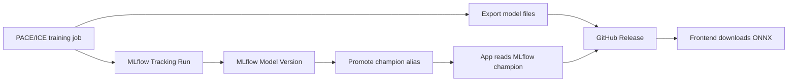

# Model Publish Workflow

This is the end-to-end workflow for publishing a trained LizardMorph model from
PACE/ICE into the app.

## Architecture



MLflow stores experiment metadata, metrics, params, tags, and model registry
versions. GitHub Releases store the actual downloadable model files.

## Required Outputs

Each published release should contain:

```text
best.pt
best_fp16.onnx
best_fp32.onnx
metadata.json
```

`metadata.json` must include asset filenames that match the uploaded release
asset names:

```json
{
  "version": "v1.2.0-obb",
  "trained": "2026-04-24",
  "author": "Name <email@example.com>",
  "architecture": "models/base_models/yolo11m-obb.pt",
  "task": "obb",
  "config": "H12_obb",
  "dataset": {
    "nc": 6,
    "names": ["up_finger", "up_toe", "bot_finger", "bot_toe", "ruler", "id"],
    "train_images": 679,
    "val_images": 170
  },
  "training": {
    "epochs": 300,
    "batch": 32,
    "imgsz": 1280,
    "patience": 50
  },
  "metrics": {
    "best_epoch": 175,
    "epochs_completed": 225,
    "mAP50": 0.97239,
    "mAP50-95": 0.94211,
    "precision": 0.96586,
    "recall": 0.95882
  },
  "assets": {
    "pt": "best.pt",
    "fp16": "best_fp16.onnx",
    "fp32": "best_fp32.onnx"
  }
}
```

## One-Time Setup on PACE/ICE

```bash
export MLFLOW_TRACKING_URI=http://<app-server>:5000
export GITHUB_REPO=Human-Augment-Analytics/Lizard_Toepads
```

Authenticate GitHub CLI once:

```bash
gh auth login
```

Confirm MLflow is reachable from PACE/ICE:

```bash
curl "$MLFLOW_TRACKING_URI"
```

## Publish Flow

### 1. Train and Export

Run the training job on PACE/ICE, then export:

```bash
# Example only. Use the actual project training/export command.
python train.py --config configs/H12_obb.yaml

# Expected final files:
ls best.pt best_fp16.onnx best_fp32.onnx metadata.json
```

### 2. Create GitHub Release

Use one release tag per model artifact set.

```bash
MODEL_NAME=H12_obb
VERSION=v1.2.0-obb
RELEASE_TAG=model/$VERSION

gh release create "$RELEASE_TAG" \
  best.pt best_fp16.onnx best_fp32.onnx metadata.json \
  --repo "$GITHUB_REPO" \
  --title "$RELEASE_TAG"
```

If the release already exists:

```bash
gh release upload "$RELEASE_TAG" \
  best.pt best_fp16.onnx best_fp32.onnx metadata.json \
  --repo "$GITHUB_REPO" \
  --clobber
```

### 3. Register Run and Model Version in MLflow

Run this from the same environment that has access to MLflow:

```python
import mlflow
from mlflow import MlflowClient

tracking_uri = "http://<app-server>:5000"
github_repo = "Human-Augment-Analytics/Lizard_Toepads"
model_name = "H12_obb"
release_tag = "model/v1.2.0-obb"
release_url = f"https://github.com/{github_repo}/releases/tag/{release_tag}"

mlflow.set_tracking_uri(tracking_uri)
mlflow.set_experiment(model_name)

with mlflow.start_run(run_name=f"{model_name}_{release_tag.replace('model/', '')}") as run:
    mlflow.log_params({
        "model_name": model_name,
        "release_tag": release_tag,
        "task": "obb",
        "imgsz": 1280,
        "batch": 32,
        "epochs": 300,
    })

    mlflow.log_metrics({
        "mAP50": 0.97239,
        "mAP50-95": 0.94211,
        "precision": 0.96586,
        "recall": 0.95882,
    })

    mlflow.set_tags({
        "github_release_tag": release_tag,
        "github_release_url": release_url,
    })

    client = MlflowClient()
    try:
        client.create_registered_model(model_name)
    except Exception:
        pass

    model_version = client.create_model_version(
        name=model_name,
        source=release_url,
        run_id=run.info.run_id,
    )

    print(f"Registered {model_name} version {model_version.version}")
```

Important:

- `github_release_tag` links the MLflow run to the GitHub Release.
- `create_model_version()` is required; logging a run alone is not enough.
- `source` should point to the GitHub Release URL, not a local PACE/ICE path.

### 4. Promote the Model

Promotion means assigning the MLflow alias `champion`.

Use the MLflow UI:

```text
MLflow UI
-> Models
-> H12_obb
-> Version <version-from-previous-step>
-> Add/Edit alias
-> champion
```

Or use MLflow client code:

```python
from mlflow import MlflowClient

client = MlflowClient(tracking_uri="http://<app-server>:5000")
client.set_registered_model_alias("H12_obb", "champion", "<version-from-previous-step>")
```

The `champion` alias is the deployment pointer. The app-side `model-api` reads
this alias, but PACE/ICE publish scripts do not need to call `model-api`.

### 5. Verify in MLflow

Check registered model versions:

```python
from mlflow import MlflowClient

client = MlflowClient(tracking_uri="http://<app-server>:5000")
print(client.search_model_versions("name = 'H12_obb'"))
```

Check current champion:

```python
from mlflow import MlflowClient

client = MlflowClient(tracking_uri="http://<app-server>:5000")
print(client.get_model_version_by_alias("H12_obb", "champion"))
```

Check experiment runs:

```python
import mlflow

mlflow.set_tracking_uri("http://<app-server>:5000")
experiment = mlflow.get_experiment_by_name("H12_obb")
print(mlflow.search_runs([experiment.experiment_id]))
```

For local app testing, open `/#/models`; that is app verification, not part of
the PACE/ICE publish workflow.

## Operational Checklist

Before promote:

- Metrics are better than the current `champion`.
- `metadata.json` matches the uploaded assets.
- Release tag is unique and immutable for the published model.
- Run tag `github_release_tag` exactly matches the GitHub Release tag.
- Model version exists in MLflow Registry.

After promote:

- MLflow Model Registry shows alias `champion` on the expected version.
- The model version points back to the correct MLflow run.
- The run tag `github_release_tag` points to a valid GitHub Release.

## Rollback

Promote the previous known-good version again:

```python
from mlflow import MlflowClient

client = MlflowClient(tracking_uri="http://<app-server>:5000")
client.set_registered_model_alias("H11_obb", "champion", "2")
```

No files need to move. The alias changes which model the app treats as current.

## Troubleshooting

### `/model/latest` says no model promoted

The model version was registered but no version has alias `champion`. Set the
alias in MLflow UI or with `set_registered_model_alias()`.

### `/model/latest` says `github_release_tag` is missing

The MLflow run does not have the required tag:

```python
mlflow.set_tag("github_release_tag", "model/v1.2.0-obb")
```

For an existing run, use `MlflowClient().set_tag(run_id, key, value)`.

### Download URL is empty

The asset name in `metadata.json` does not match the actual GitHub Release asset
name. Fix `metadata.json` and re-upload it with `gh release upload --clobber`.

### Frontend shows repeated runs

Repeated registration attempts with the same `github_release_tag` can create
multiple MLflow runs. The model-api now dedupes runs by release tag by default.
The cleaner operational fix is to publish one MLflow run per release tag.

### Wrong model appears as latest

Check aliases in MLflow:

```python
from mlflow import MlflowClient

client = MlflowClient(tracking_uri="http://<app-server>:5000")
print(client.get_model_version_by_alias("H12_obb", "champion"))
```

The app uses the most recently promoted version with alias `champion`.
