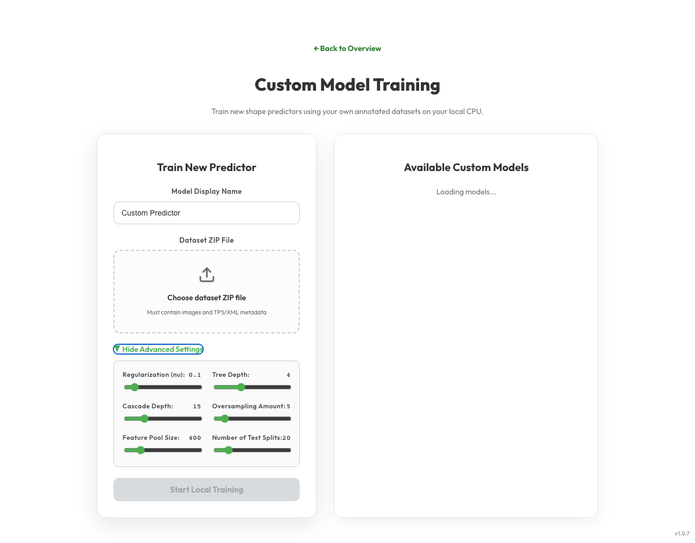

# 🎓 How to Train a Custom Shape Predictor Model

This tutorial guides you through preparing your annotated dataset and training a custom dlib shape predictor model locally on your CPU using the LizardMorph interface.

---

## 📹 Video Walkthrough
Below is a video recording showing the entire process of uploading the *Drosophila* wing dataset and training the custom model in LizardMorph:

---

## 📋 Step-by-Step Training Guide

### Step 1: Prepare your Dataset ZIP File
To train a custom shape predictor, you must package your images and their coordinates into a single flat ZIP file. The ZIP archive must satisfy the following format:

1.  **Unique Image Files**: Include all specimen images (e.g., `.jpg`, `.jpeg`, `.png`) flatly in the root of the archive.
2.  **Exactly One Annotation File**: Include exactly one coordinate file in the root:
    *   **TPS Format (`.tps`)**: A standard Thin Plate Spline file containing landmark listings mapped to corresponding image files (e.g., `IMAGE=63001.jpg`).
    *   **XML Format (`.xml`)**: A standard dlib training XML file (in dlib dataset format) referencing the images.
3.  **Flat Directory Structure**: Ensure no nested subdirectories are present.

> [!IMPORTANT]
> When deployed in hosted web mode (configured via environment variable `LIZARDMORPH_HOSTED=true`), the application enforces safety limits to prevent server resource exhaustion or Denial-of-Service:
> *   Maximum ZIP upload size: **100 MB**
> *   Maximum file count inside the ZIP: **500 files**
> *   Maximum uncompressed size of any single file: **20 MB**
> *   Maximum total uncompressed size: **100 MB**
> 
> *Note: When running locally (default local servers or inside the Electron desktop application wrapper), these limits are extended up to 10 GB to support training large specimen collections.*

---

### Step 2: Open the Training Dashboard
1.  Launch the LizardMorph web app or desktop application.
2.  On the **Overview** page, scroll to the bottom and click the **Train Custom Model** button.
3.  This opens the `/custom` route (the Custom Model Training Dashboard).

---

### Step 3: Configure and Upload
1.  **Model Display Name**: Enter a descriptive name for your custom shape predictor (e.g., `Drosophila Wing Predictor`).
2.  **Upload Dataset**: Drag-and-drop your prepared dataset `.zip` file into the upload dropzone, or click the dropzone to browse your local filesystem.
3.  **Configure Parameters (Optional)**: Click **Show Advanced Settings** to reveal the training parameter sliders.
4.  **Configure Test Split Ratio**: Adjust the **Test Split Ratio** slider (e.g., `20%`) to partition your dataset. If set above `0%`, the system will set aside those images to evaluate accuracy after training is complete.

---

## ⚙️ Advanced Training Parameters

If you are working with specialized datasets (e.g. very small image counts, high landmark counts, or noisy backgrounds), you can optimize the shape predictor's performance using the following parameters:

| Parameter | Default | Range | Explanation & Impact |
| :--- | :---: | :---: | :--- |
| **Regularization (nu)** | `0.1` | `0.01` - `1.0` | Regularization parameter. Smaller values (e.g. `0.05` to `0.1`) increase regularization, preventing the model from overfitting on small datasets but potentially underfitting complex patterns. |
| **Tree Depth** | `4` | `2` - `8` | Depth of the regression trees in the ensembles. Deeper trees (e.g., `5`) model complex, non-linear relationships but require significantly more training data to remain robust. |
| **Cascade Depth** | `15` | `1` - `60` | Number of cascade stages. Higher cascade counts (e.g. `30`) refine the landmarks iteratively for higher precision, but increase the final `.dat` model file size. |
| **Oversampling Amount** | `5` | `0` - `50` | The number of times each image is randomly deformed and replicated. Larger oversampling increases rotation and translation robustness but prolongs training time. |
| **Feature Pool Size** | `400` | `50` - `2000` | The number of pixel intensity comparison pairs sampled to construct each tree. Larger pools yield higher landmark resolution at the expense of higher CPU memory consumption. |
| **Number of Test Splits** | `20` | `5` - `100` | The number of candidate feature splits evaluated at each tree node. Higher values search more splits to find optimal decisions, which increases training duration. |
| **Test Split Ratio** | `20%` | `0%` - `50%` | The percentage of the uploaded dataset split and reserved to evaluate the trained shape predictor. The calculated mean pixel error on the test dataset is reported upon model completion. |

---

### Step 4: Start Training
1.  Click the **Start Local Training** button.
2.  The application will upload the ZIP archive and trigger a CPU training process in a background thread.
3.  The dashboard will show a **"Training..."** progress bar and report the active background Job ID. 
4.  *Note: Only one local training job is allowed to execute at any given time. If multiple users/tabs submit jobs, they will be queued automatically.*

---

### Step 5: Verification & Deletion
*   Once completed, the newly trained predictor model will be registered in the available custom models database.
*   The model will appear in the **Available Custom Models** list displaying its name, file size, target landmark count, and its **Test Error** (e.g., `Test Error: 12.95 px` representing the average pixel distance error between predictions and ground-truth coordinates on the test set).
*   To delete a model from the system, click the **Delete** button next to the model entry.
